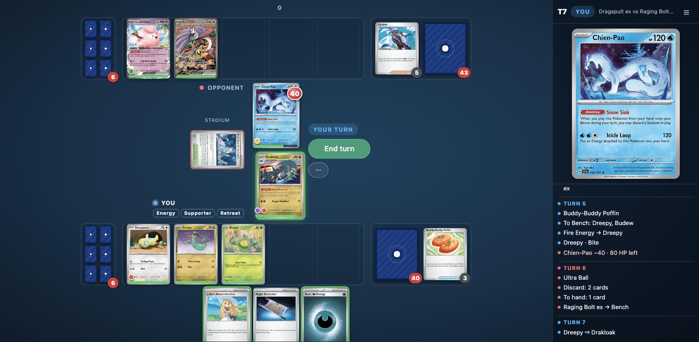
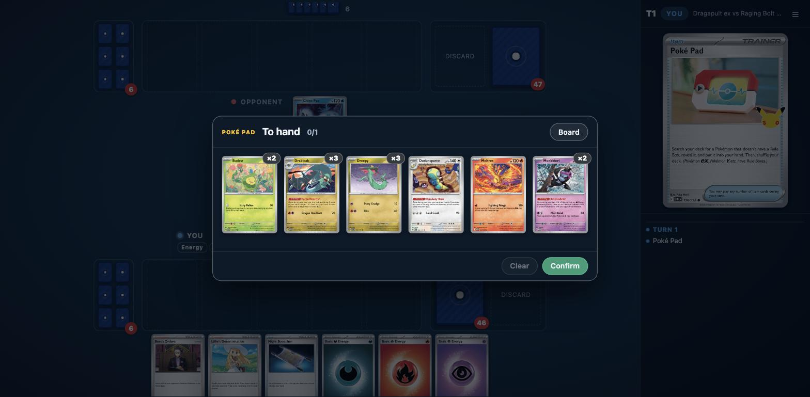
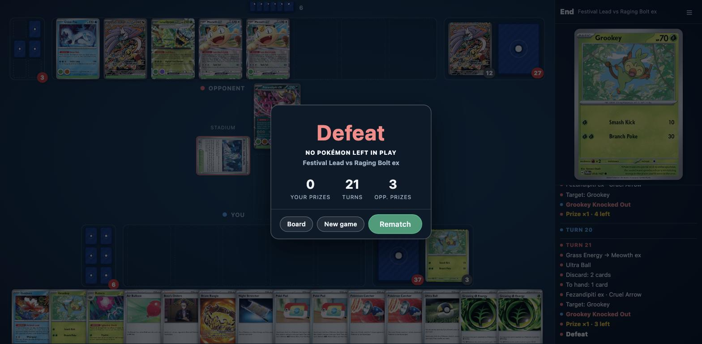

# Local web client

Play the Rust engine in a browser. You are player 0 (bottom); the opponent is a bot.



## Build the bindings

```
cd python
maturin develop --release        # into the repo .venv  (or: maturin build, then install the wheel)
cd ..
```

The server needs `import ptcg` to work (`ptcg._ptcg` is the compiled module, git-ignored; in a worktree, copy
`python/ptcg/_ptcg*.so` from a checkout that has it). It also reads `data/cards.json` and
`decks/meta/playable.corpus.json`. No extra Python dependencies (stdlib `http.server`).

## Run

```
.venv/bin/python client/server.py [--port 8765] [--bot greedy|random]
```

Open http://localhost:8765, pick both decks (the picker shows each list as card images), and start.

## Playing

The table is sized from the window, so the whole board fits without scrolling (checked at 1280×800, 1440×900 and
1440×706). Card images come from Limitless's CDN
(`limitlesstcg.nyc3.cdn.digitaloceanspaces.com/tpci/SET/SET_NNN_R_EN_SM|LG.png`, international set and number from
`data/pool.json`). Every card in the shipped decks has one. A card whose image fails to load is drawn as a text card.
You can switch images off in the ☰ menu.

| Do this | How |
| --- | --- |
| Play a card | Click a green-outlined hand card. A card with one possible play is played at once. Otherwise its targets light up: click one, or drag the card onto it. Click the card again or press Esc to cancel. |
| Attach Energy, a Tool, or evolve | Drag the card onto a lit Pokémon, or click the card and then the Pokémon. |
| Attack, use an ability, retreat | Click your Active (or a Benched Pokémon with an ability). A menu lists its attacks with costs and damage, its abilities, and Retreat. Moves you can't use now are greyed out. |
| End the turn | **End turn**. If you could still attack, it asks you to click again (**Confirm end**). |
| Choose Pokémon in play | The choices light up on the board. A single pick takes effect on click; for several picks, click them and then **Confirm**. For damage counters, each click adds one and right-click takes one off. |
| Choose cards from your hand | The choices light up in your hand (setup: badge **A** = Active, **B1…** = Bench). |
| Choose cards from a deck, discard, prizes, revealed cards | A dialog shows the card faces. Identical cards share one tile with a ×N count; click it once per copy. **Board** hides the dialog so you can look at the table, and **Show** brings it back. |
| Read a card | Hover it to show it large in the side panel, or right-click to zoom. |
| Look at a discard pile / Lost Zone | Click the pile. |
| Anything else | **⋯** lists every legal action. |

A small gold label above a prompt names the card, attack or ability it belongs to. Enter confirms a prompt and Esc
cancels or closes.

The log is kept short: a colored dot shows whose action it was, followed by the action, e.g.
`Dragapult ex · Phantom Dive`, `Iron Leaves ex −200 · 10 HP left`, `Prize ×2 · 3 left`.

 

## Bots

- `greedy` (default) plays a few random cards, Energy (to the Active first) and abilities, then attacks whenever it
  can. Other prompts are answered at random.
- `random` picks uniformly random legal answers, so it rarely attacks.

Add a class with `choose(session) -> indices | None` to `POLICIES` in `policies.py` to plug in a smarter bot
(`--bot NAME`, or pick it in the new-game dialog).

## Smoke test

```
.venv/bin/python client/smoke_test.py [--seed N] [--url http://localhost:8765]
```

Plays a full game through the HTTP API (random answers for seat 0, the default bot for seat 1) and asserts it
finishes.

## Layout of the code

- `server.py`: HTTP API (`/api/decks`, `/api/deck`, `/api/new`, `/api/state`, `/api/choice`, `/api/answer`,
  `/api/validate`) and static files.
- `game.py`: `GameSession` wraps `ptcg.Env`. It hides what player 0 may not see (hand, deck and prize contents, and
  the opponent's face-down Pokémon during setup), runs the bot, builds card data, and writes the log from
  `canonical()` diffs. Card serials are remembered for the whole game, so cards in temporary lists (the top cards
  you look at, revealed cards) still show their faces in prompts.
- `policies.py`: opponent policies.
- `static/`: single-page frontend (`index.html`, `style.css`, `app.js`), no build step.

## Binding limits

These come from the bindings, so the client works around them:

- No event log and no coin-flip results. The log is rebuilt from state diffs, so a Pokémon's damage is shown but not
  the attack that dealt it, and coin flips are not shown at all.
- A prompt has only a numeric context, so titles are generic: "To hand" is used for searches, Recon Directive,
  and taking prizes.
- "Choose one" options have no labels.
- `pick_mask` is not exposed, so a multi-pick prompt cannot tell in advance which picks will be accepted. An illegal
  combination is rejected when you confirm, and the error is shown.
- The game result has no reason, so the game-over screen infers one (prizes, no Pokémon left, deck out).
- Mulligans have no event. They are inferred from the extra-draw prompt.
